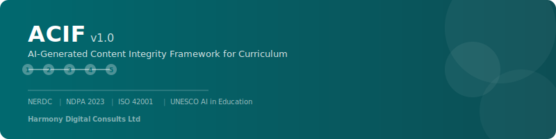

# ACIF — AI-Generated Content Integrity Framework for Curriculum

<p align="center">
  
</p>

<p align="center">
  <strong>Standards · Verification · Integrity</strong><br/>
  A comprehensive framework for ensuring AI-generated curriculum content is safe, accurate, and age-appropriate before it reaches students.
</p>

<p align="center">
  <a href="#quick-start">Quick Start</a> ·
  <a href="#framework-overview">Overview</a> ·
  <a href="#web-tool">Web Tool</a> ·
  <a href="docs/ACIF_Framework_Full_Text.md">Full Framework</a> ·
  <a href="#contributing">Contributing</a>
</p>

---

## Why ACIF?

AI tools like ChatGPT, Gemini, and Claude are increasingly used by teachers and curriculum developers to generate lesson plans, assessments, and study materials. But AI-generated content carries unique risks in classrooms:

- **Hallucinations** — AI can produce confident but completely false statements that students accept as fact
- **Age-inappropriate content** — Output may contain themes, vocabulary, or complexity unsuitable for the target age group
- **Curriculum misalignment** — Generated content may not match national curriculum standards
- **Cultural insensitivity** — Content may reflect Western-centric perspectives inappropriate for Nigerian/African classrooms
- **Data privacy violations** — Student data entered into AI tools may be processed in ways that violate data protection laws

**ACIF solves this** by defining a structured verification pipeline — with risk classification, age-band checks, hallucination detection, and curriculum alignment gates — that every piece of AI-generated content must pass before reaching students.

---

## Framework Overview

### Core Components

| Component | Description |
|---|---|
| **4 Risk Tiers** | Classify content from Low (Tier 1) to Critical (Tier 4) based on subject sensitivity, age group, and use case |
| **6 Age Bands** | Developmental guidelines from Early Childhood (3–5) through Pre-Tertiary (18+) |
| **Five-Gate Pipeline** | Sequential verification gates: Pre-Delivery Screening → Factual Verification → Age-Appropriateness → Curriculum Alignment → Final Approval |
| **FACT Method** | Hallucination detection protocol: **F**ind claims → **A**ssess risk → **C**ross-reference sources → **T**ag results |
| **Governance Structure** | Roles, responsibilities, escalation paths, and audit requirements |

### Standards Alignment

ACIF is aligned with four international and national standards:

| Standard | How ACIF Aligns |
|---|---|
| **[NERDC National Curriculum](https://nerdc.gov.ng/)** | Gate 4 enforces alignment with Nigeria's 9-Year Basic Education Curriculum and Senior Secondary curriculum |
| **[Nigeria Data Protection Act 2023 (NDPA)](https://ndpc.gov.ng/)** | Section 7 implements consent requirements, data minimisation, and prohibited data inputs for student protection |
| **[ISO/IEC 42001:2023](https://www.iso.org/standard/81230.html)** | Framework maps to AIMS clauses: risk assessment (6.1), operational planning (8.1), monitoring (9.1), and corrective action (10.2) |
| **[UNESCO GenAI in Education (2023)](https://www.unesco.org/en/digital-education/artificial-intelligence)** | Principles 1–8 implement UNESCO's guidance on human agency, age restrictions, inclusion, and AI competency development |

---

## Repository Structure

```
acif-repo/
├── README.md                          # This file
├── LICENSE                            # CC BY-SA 4.0 License
├── CHANGELOG.md                       # Version history
├── CONTRIBUTING.md                    # Contribution guidelines
├── CODE_OF_CONDUCT.md                 # Community standards
├── SECURITY.md                        # Security policy
├── docs/
│   ├── ACIF_Framework_v1.0.pdf        # Full framework (41-page PDF)
│   ├── ACIF_Framework_Full_Text.md    # Framework in Markdown format
│   ├── IMPLEMENTATION_GUIDE.md        # Step-by-step adoption guide
│   ├── FAQ.md                         # Frequently Asked Questions
│   └── GLOSSARY.md                    # Key terms and definitions
├── web-tool/
│   ├── index.html                     # ACIF Verification Pipeline Tool
│   ├── styles.css                     # Styles
│   └── app.js                         # Application logic
├── templates/
│   ├── hallucination-log.csv          # Blank hallucination log template
│   ├── content-registry.csv           # Blank content registry template
│   ├── ai-tool-assessment.md          # AI tool evaluation checklist
│   ├── gate-checklist.md              # Printable Five-Gate checklist
│   └── parental-communication.md      # Template letter for parents
├── assets/
│   └── acif-banner.svg                # Project banner
└── .github/
    └── ISSUE_TEMPLATE/
        ├── bug_report.md              # Bug report template
        ├── feature_request.md         # Feature request template
        └── framework_feedback.md      # Framework content feedback
```

---

## Quick Start

### For Schools Adopting ACIF

1. **Read the Framework** — Start with the [Full Framework PDF](docs/ACIF_Framework_v1.0.pdf) or the [Markdown version](docs/ACIF_Framework_Full_Text.md)
2. **Follow the Implementation Guide** — See [docs/IMPLEMENTATION_GUIDE.md](docs/IMPLEMENTATION_GUIDE.md) for a 3-month rollout plan
3. **Use the Web Tool** — Open `web-tool/index.html` in any browser to start classifying and verifying AI content
4. **Print the Templates** — Use the files in `templates/` for offline verification workflows

### For Developers / EdTech Platforms

1. Clone this repository:
   ```bash
   git clone https://github.com/Chukwuemerie-ezieke/acif-framework.git
   ```
2. The web tool is a static HTML/CSS/JS application — no build step required
3. Open `web-tool/index.html` to run locally
4. Integrate the risk classification logic and gate checklists into your platform
5. See [CONTRIBUTING.md](CONTRIBUTING.md) for how to contribute

---

## Web Tool

The ACIF Verification Pipeline Tool is a browser-based application that implements the full framework:

| Module | Function |
|---|---|
| **Dashboard** | Overview stats, pipeline visualisation, quick actions |
| **Risk Classifier** | Interactive questionnaire to assign Risk Tier 1–4 |
| **Verification Pipeline** | Sequential Five-Gate checklist with reviewer sign-off |
| **Age Checker** | Age-band specifications with allowed/prohibited theme lists |
| **Hallucination Log** | Log, search, and export hallucination incidents |
| **Content Registry** | Track all approved AI-generated content with full audit trail |

**Requirements:** Any modern web browser (Chrome, Firefox, Edge, Safari). No server needed — all data is stored in browser localStorage.

**To run:** Simply open `web-tool/index.html` in your browser.

---

## Risk Tier Quick Reference

| Tier | Level | Examples | Required Gates |
|---|---|---|---|
| **Tier 1** | Low | Timetables, creativity prompts, templates | Gates 1 + 5 |
| **Tier 2** | Medium | Lesson plans, explanatory notes, objective assessments | All 5 Gates |
| **Tier 3** | High | Health/science facts, history, religion, Early Childhood content | All 5 Gates + Senior sign-off |
| **Tier 4** | Critical | Sensitive topics, formal exams, external publications | All 5 Gates + Director + Legal review |

---

## Age Bands Quick Reference

| Band | Ages | Key Restrictions |
|---|---|---|
| **Band 1** | 3–5 (Nursery) | Oral/visual only, max 8-word sentences, no conflict themes |
| **Band 2** | 6–8 (Primary 1–3) | Lexile 200–500, no violence or fear-inducing content |
| **Band 3** | 9–11 (Primary 4–6) | Lexile 500–800, death/illness handled with care |
| **Band 4** | 12–14 (JSS 1–3) | Lexile 800–1100, puberty content requires Health Educator sign-off |
| **Band 5** | 15–17 (SS 1–3) | Lexile 1100–1400, complex moral/ethical topics allowed |
| **Band 6** | 18+ (Pre-Tertiary) | University-level, all WAEC/NECO content must match official syllabus |

---

## The FACT Method

A systematic approach to detecting AI hallucinations in educational content:

```
F — Find the claim      Identify every factual assertion (not opinions or questions)
A — Assess the risk      Is this claim specific enough to be wrong? Is it checkable?
C — Cross-reference      Verify against at least 2 independent authoritative sources
T — Tag the result       Mark as VERIFIED, MODIFIED (corrected), or REMOVED
```

No content proceeds to the next gate until **all** claims are tagged and **zero** unverified claims remain.

---

## Contributing

We welcome contributions from educators, developers, policymakers, and anyone working at the intersection of AI and education. See [CONTRIBUTING.md](CONTRIBUTING.md) for:

- How to propose framework changes
- How to contribute to the web tool
- How to submit translations
- Code of Conduct

---

## License

This work is licensed under the [Creative Commons Attribution-ShareAlike 4.0 International License](LICENSE) (CC BY-SA 4.0).

You are free to:
- **Share** — copy and redistribute the material in any medium or format
- **Adapt** — remix, transform, and build upon the material for any purpose, including commercially

Under the following terms:
- **Attribution** — You must give appropriate credit to Harmony Digital Consults Ltd
- **ShareAlike** — If you remix or build upon this material, you must distribute your contributions under the same license

---

## About

**Developed by [Harmony Digital Consults Ltd](https://harmonydigi.com)**
Anambra State, Nigeria

ACIF is part of Harmony Digital Consults' mission to make AI adoption in Nigerian education safe, ethical, and standards-compliant. The framework is designed for adoption by any educational institution in Nigeria and across Africa.

**Contact:** For institutional adoption support, training, or integration into EdTech platforms, reach out via the repository Issues page or contact Harmony Digital Consults directly.

---

<p align="center">
  <sub>ACIF v1.0 · © 2026 Harmony Digital Consults Ltd · Licensed under CC BY-SA 4.0</sub>
</p>
